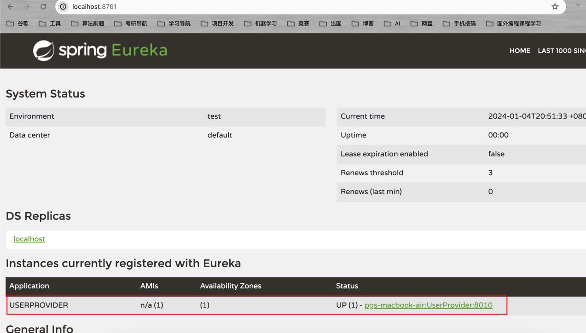

# 微服务注册与发现 Eureka

&emsp;Eureka是Netflix开发的服务发现组件，本身是一个基于REST的服务。Spring Cloud将它集成在其子项目Spring-cloud-netflix中，以实现Spring Cloud的服务发现功能。


## 版本信息：

- Spring Boot: 3.0.9
- Spring Cloud: 2022.0.4
- JDK >= 17

## 对应版本文档

- [https://docs.spring.io/spring-cloud-netflix/docs/4.0.3/reference/html/](https://docs.spring.io/spring-cloud-netflix/docs/4.0.3/reference/html/)

## 项目创建

&emsp;创建一个Maven工程，向pom.xml里添加下述父级依赖：

```xml
<?xml version="1.0" encoding="UTF-8"?>
<project xmlns="http://maven.apache.org/POM/4.0.0"
         xmlns:xsi="http://www.w3.org/2001/XMLSchema-instance"
         xsi:schemaLocation="http://maven.apache.org/POM/4.0.0 http://maven.apache.org/xsd/maven-4.0.0.xsd">
    <modelVersion>4.0.0</modelVersion>

    <groupId>org.ning</groupId>
    <artifactId>cloud-study</artifactId>
    <version>1.0-SNAPSHOT</version>

    <properties>
        <maven.compiler.source>11</maven.compiler.source>
        <maven.compiler.target>11</maven.compiler.target>
        <project.build.sourceEncoding>UTF-8</project.build.sourceEncoding>
    </properties>
    
    <!-- 引入Spring boot父级工程版本为3.0.9 -->
    <parent>
        <groupId>org.springframework.boot</groupId>
        <artifactId>spring-boot-starter-parent</artifactId>
        <version>3.0.9</version>
    </parent>

    <dependencies>
        <dependency>
            <groupId>org.springframework.boot</groupId>
            <artifactId>spring-boot-starter-web</artifactId>
        </dependency>
        <dependency>
            <groupId>org.projectlombok</groupId>
            <artifactId>lombok</artifactId>
        </dependency>
    </dependencies>
    
    <!--    添加微服务，集中管理组件版本-->
    <dependencyManagement>
        <dependencies>
            <dependency>
                <groupId>org.springframework.cloud</groupId>
                <artifactId>spring-cloud-dependencies</artifactId>
                <version>2022.0.4</version>
                <type>pom</type>
                <scope>import</scope>
            </dependency>
        </dependencies>
    </dependencyManagement>

</project>
```

## 搭建Eureka服务端

&emsp;Eureka服务端可以用来管理所有在Eureka注册过的微服务信息，在Eureka注册过的微服务就是Eureka的客户端。

&emsp;创建一个Maven子模块eureka-service,引入下述依赖:

```xml
<dependencies>
    <dependency>
        <groupId>org.springframework.cloud</groupId>
        <artifactId>spring-cloud-starter-netflix-eureka-server</artifactId>
    </dependency>
</dependencies>
```

&emsp;创建配置文件`application.yml`，编写下述信息:

```yaml
server:
  port: 8761

spring:
  application:
    name: EurekaService # 设置这个spring应用名称为EurekaService

eureka:
  instance:
    prefer-ip-address: true # 指定注册的微服务使用IP地址作为实例的标识
    hostname: localhost # 设置微服务实例主机地址
  # Eureka服务本身也是微服务，因此它也可以将自己注册到Eureka中
  client:
    register-with-eureka: false # 不将自己注册到Eureka服务里
    fetch-registry: false # 自己不从Eureka服务里获取注册表信息
    service-url: 
      defaultZone: http://${eureka.instance.hostname}:${server.port}/eureka/ # Eureka服务器的URL
```

> Eureka默认使用的多体注册服务，这里为了演示，只使用单体Eureka服务。

&emsp;然后创建一个`EurekaServiceApplication`启动类:

```java
package org.ning;

import org.springframework.boot.SpringApplication;
import org.springframework.boot.autoconfigure.SpringBootApplication;
import org.springframework.cloud.netflix.eureka.server.EnableEurekaServer;

/**
 * @Project: org.ning
 * @Author: pgthinker
 * @Date: 2024/1/4 20:16
 * @Description:
 */
@EnableEurekaServer
@SpringBootApplication
public class EurekaServiceApplication {
    public static void main(String[] args) {
        SpringApplication.run(EurekaServiceApplication.class,args);
    }
}
```

&emsp;启动完成后，访问`localhost:8761`即可看到`Eureka`提供的默认页面。在该页面中，可以看到所有在Eureka注册的微服务信息。


## 搭建Eureka客户端

&emsp;在Eureka进行注册的微服务都属于Eureka的客户端。微服务注册是微服务架构的基本原则，一般来说，微服务只有进行了注册，才能在微服务集群里进行使用。

&emsp;Eureka客户端根据自己的功能分为:`服务提供者`和`服务消费者`，下面将构建这两类客户端。

### 创建服务提供者UserProvider

&emsp;创建一个Maven子模块`user-provider`,在pom.xml中添加下述依赖:

```xml
<dependencies>
    <dependency>
        <groupId>org.springframework.cloud</groupId>
        <artifactId>spring-cloud-starter-netflix-eureka-client</artifactId>
    </dependency>
</dependencies>
```

&emsp;创建配置文件`application.yml`,并配置如下信息:

```yaml
server:
  port: 8010

spring:
  application:
    name: UserProvider

eureka:
  instance:
    prefer-ip-address: true # 将当前IP注册到Eureka服务中

  client:
    service-url:
      defaultZone: http://localhost:8761/eureka/ # Eureka注册服务地址
```

&emsp;创建`UserProviderApplication`启动类:

```java
package org.ning;

import org.springframework.boot.SpringApplication;
import org.springframework.boot.autoconfigure.SpringBootApplication;

/**
 * @Project: org.ning
 * @Author: pgthinker
 * @Date: 2024/1/4 20:49
 * @Description:
 */
@SpringBootApplication
public class UserProviderApplication {
  public static void main(String[] args) {
    SpringApplication.run(UserProviderApplication.class,args);
  }
}

```

&emsp;启动后，访问Eureka的后台中心`localhost:8761`，可以看到多出了一个注册了的微服务。



### 创建服务消费者

&emsp;服务消费者的创建和服务提供者的创建一致，提供与消费是一个相对概念，一个服务提供者它既可以作为提供者也可以作为消费者。

&emsp;这里创建子模块user-consumer,引入相关依赖后，创建`application.yml`配置如下信息:

```yaml
server:
  port: 8020

spring:
  application:
    name: UserConsumer

eureka:
  instance:
    prefer-ip-address: true
  
  client:
    service-url:
      defaultZone: http://localhost:8761/eureka/
```

&emsp;然后创建启动类，启动。

```java
package org.ning;

import org.springframework.boot.SpringApplication;
import org.springframework.boot.autoconfigure.SpringBootApplication;

/**
 * @Project: org.ning
 * @Author: pgthinker
 * @Date: 2024/1/4 20:57
 * @Description:
 */
@SpringBootApplication
public class UserConsumerApplication {
    public static void main(String[] args) {
        SpringApplication.run(UserConsumerApplication.class,args);
    }
}
```


## Eureka的作用

- 需要注册的服务提供者(案例中的`UserClientApplication`应用)在启动时会向Eureka中心(上述案例中的`EurekaServiceApplication`应用)注册自己的信息；
- Eureka会保存这些信息
- 服务消费者根据服务名称向Eureka拉取服务提供者信息
- 服务消费者利用负载均衡算法从服务列表中挑选一个使用
- 服务提供者每隔30s向EurekaService发送心跳请求，报告健康状态
- EurekaService会更新记录服务列表信息，剔除心跳不正常的服务

## Eureka架构中的角色

- EurekaServer: 服务端，也就是微服务的注册中心。案例中的EurekaService.
  - 记录服务信息
  - 心跳监控
- EurekaClient：客户端，也就是向注册中心进行注册了的微服务
  - Provider：服务提供者。例如案例中的UserProvider
    - 注册自己的信息到EurekaServer
    - 每隔30s向EurekaServer发送心跳
  - Consumer：服务消费者。例如案例中的UserConsumer
    - 根据服务名称从`EurekaServer`拉取服务列表
    - 基于服务列表做负载均衡，然后选择一个微服务发起远程调用

> 案例中UserProvider和UserConsumer并没有出现调用与被调用的情况，因此是辨别哪个是服务提供者和服务消费者的。之后的案例中，将不断完善这两个服务，以便更好的从功能上进行区分。

