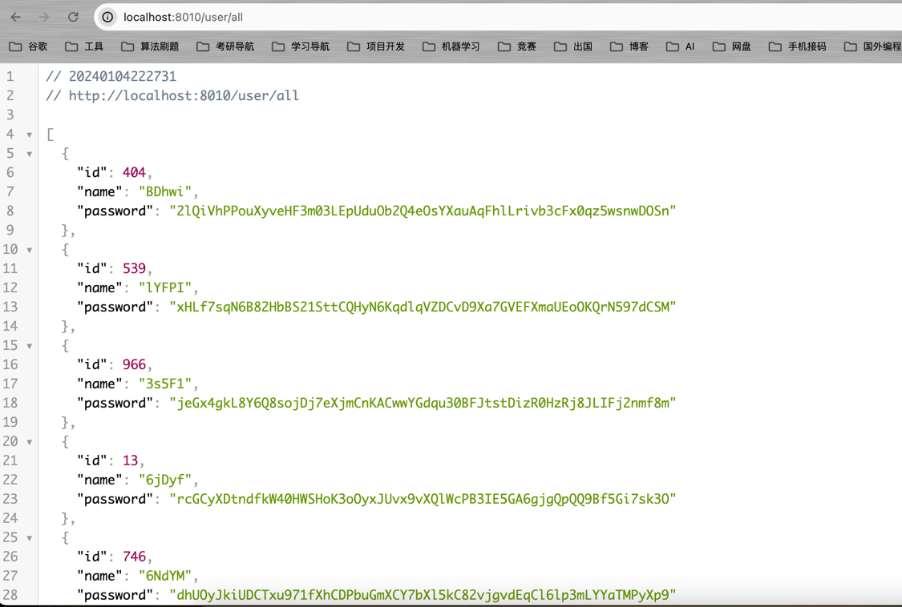
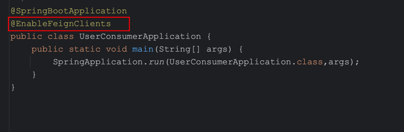
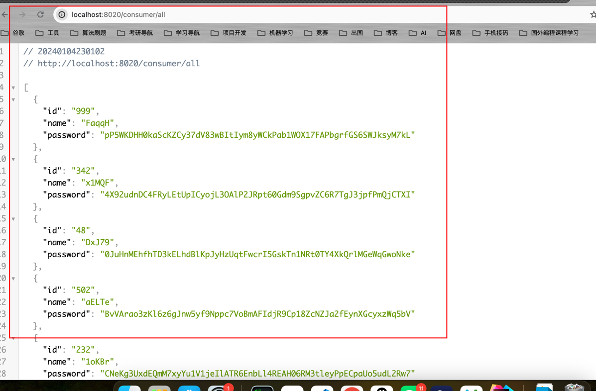
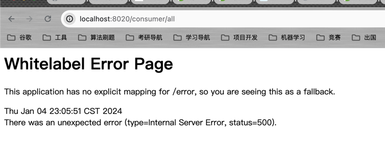
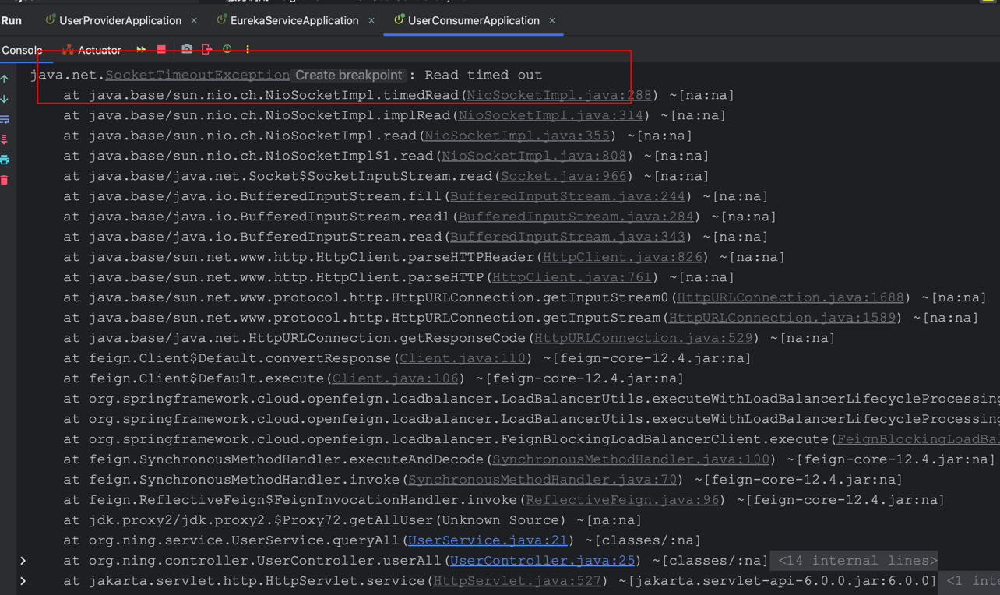

# 服务调用组件 Feign

## 传统调用问题

&emsp;微服务之间的服务调用一般采用Http协议进行调用，并且使用RestFul API接口规范。在Spring Web模块中提供了一个基于Rest规范的Http请求工具`RestTemplate`。应用中如果需要访问第三方提供的Rest接口，就可以使用RestTemplate操作。

&emsp;在微服务中，服务消费者可以通过如下代码来调用服务提供者的服务。

```java
String url = "http://userprovider/user/" + userId;
User user = restTemplate.getForObject(url, User.class);
```

&emsp;但这种调用存在以下问题：

- 代码可读性很差，编程体验不统一；
- 参数复杂时，URL难以维护。

## Feign介绍

&emsp;Feign是一个声明式Web服务客户端。其作用就是帮助我们优雅地实现http请求，解决上述调用问题。

- 文档：[https://docs.spring.io/spring-cloud-openfeign/docs/4.0.4/reference/html/](https://docs.spring.io/spring-cloud-openfeign/docs/4.0.4/reference/html/)

## Feign的基本使用

&emsp;在介绍Feign的基本使用前，我们先完善服务的提供者和消费者。

- `UserProvider`提供一个`/user/all`接口用于查询所有的用户信息；
- `UserConsumer`会调用`UserProvider`对外暴露的服务接口。`UserConsumer`也会对外暴露接口，我们可以通过该接口进行微服务的测试。

### `UserProvider`实现

&emsp;实体类:`User`

```java
package org.ning.entity;

import lombok.Data;

/**
 * @Project: org.ning.entity
 * @Author: pgthinker
 * @Date: 2024/1/4 22:18
 * @Description:
 */
@Data
public class User {
    private Integer id;
    private String name;
    private String password;
}
```

&emsp; UserRepository类

```java
package org.ning.repository;

import org.ning.entity.User;
import org.springframework.stereotype.Repository;

import java.util.ArrayList;
import java.util.List;
import java.util.Random;


/**
 * @Project: org.ning.repository
 * @Author: pgthinker
 * @Date: 2024/1/4 22:19
 * @Description:
 */
@Repository
public class UserRepository {
    private static final String CHARACTERS = "ABCDEFGHIJKLMNOPQRSTUVWXYZabcdefghijklmnopqrstuvwxyz0123456789";

    public List<User> findAll(){
        return generateUserList(10);
    }

    // 随机生成10用户数据
    private List<User> generateUserList(int number){
        Random random = new Random();
        List<User> users = new ArrayList<>();
        for (int i = 0; i < number; i++) {
            User user = new User();
            user.setId(random.nextInt(10,1000));
            user.setName(generateRandomString(5));
            user.setPassword(generateRandomString(64));
            users.add(user);
        }
        return users;
    }

    private String generateRandomString(int length) {
        Random random = new Random();
        StringBuilder sb = new StringBuilder(length);

        for (int i = 0; i < length; i++) {
            int randomIndex = random.nextInt(CHARACTERS.length());
            char randomChar = CHARACTERS.charAt(randomIndex);
            sb.append(randomChar);
        }

        return sb.toString();
    }
}
```

&emsp; UserController类

```java
package org.ning.controller;

import lombok.RequiredArgsConstructor;
import org.ning.entity.User;
import org.ning.repository.UserRepository;
import org.springframework.web.bind.annotation.GetMapping;
import org.springframework.web.bind.annotation.RequestMapping;
import org.springframework.web.bind.annotation.RestController;

import java.util.List;

/**
 * @Project: org.ning.controller
 * @Author: pgthinker
 * @Date: 2024/1/4 22:25
 * @Description:
 */
@RestController
@RequestMapping("user")
@RequiredArgsConstructor
public class UserController {
    private final UserRepository userRepository;
    @GetMapping("all")
    public List<User> findAll(){
        return userRepository.findAll();
    }
}
```

&emsp;服务提供者接口数据如下：



### UserConsumer实现

&emsp;服务消费者调用服务提供者的服务后，需要将得到的数据转化为相关的对象。因此我们还需要在服务消费者里创建`User`实体类。

```java
package org.ning.entity;

import lombok.Data;

/**
 * @Project: org.ning.entity
 * @Author: pgthinker
 * @Date: 2024/1/4 22:32
 * @Description:
 */
@Data
public class User {
    private String id;
    private String name;
    private String password;
}
```

### 使用Feign客户端

&emsp;我们需要在服务消费者里使用`Feign`来调用服务提供者提供的服务。在pom.xml中引入如下依赖:

```xml
        <dependency>
            <groupId>org.springframework.cloud</groupId>
            <artifactId>spring-cloud-starter-openfeign</artifactId>
        </dependency>
```

&emsp;然后使用`@EnableFeignClients`注解来启动Feign客户端。



&emsp;创建`Feign`接口。

```java
package org.ning.feign;

import org.ning.entity.User;
import org.springframework.cloud.openfeign.FeignClient;
import org.springframework.web.bind.annotation.GetMapping;

import java.util.List;

/**
 * @Project: org.ning.feign
 * @Author: pgthinker
 * @Date: 2024/1/4 22:39
 * @Description:
 */
@FeignClient("UserProvider") // 微服务注册时的服务名称
public interface UserClient {
    @GetMapping("/user/all")
    List<User> getAllUser();
}
```

&emsp;编写`UserService`类，该类会调用feign来获取用户列表。

```java
package org.ning.service;

import lombok.RequiredArgsConstructor;
import org.ning.entity.User;
import org.ning.feign.UserClient;
import org.springframework.stereotype.Service;

import java.util.List;

/**
 * @Project: org.ning.service
 * @Author: pgthinker
 * @Date: 2024/1/4 22:42
 * @Description:
 */
@Service
@RequiredArgsConstructor
public class UserService {
    private final UserClient userClient;
    public List<User> queryAll(){
        return userClient.getAllUser();
    }
}
```

&emsp;服务消费者的controller类:

```java
package org.ning.controller;

import lombok.RequiredArgsConstructor;
import org.ning.entity.User;
import org.ning.service.UserService;
import org.springframework.web.bind.annotation.GetMapping;
import org.springframework.web.bind.annotation.RequestMapping;
import org.springframework.web.bind.annotation.RestController;

import java.util.List;

/**
 * @Project: org.ning.controller
 * @Author: pgthinker
 * @Date: 2024/1/4 22:43
 * @Description:
 */
@RequestMapping("consumer")
@RequiredArgsConstructor
@RestController
public class UserController {
    private final UserService userService;
    @GetMapping("all")
    public List<User> userAll(){
        return userService.queryAll();
    }
}
```

&emsp;通过浏览器访问服务消费者的测试接口:`localhost:8020/consumer/all`.



> 浏览器访问超时，并且报500异常时，请关闭代理再进行重试。
> 
> 
> 

### 其它

&emsp;我们在实现上述案例时发现，`User`类需要在服务提供者和服务消费者里同时定义，同时Feign接口需要在每个服务消费者里进行定义，造成重复开发。

&emsp;解决方案就是将`FeignClient`抽取为独立模块，并且把接口有关的POJO、默认的Feign配置都放到该模块中，提供给所有消费者使用。


