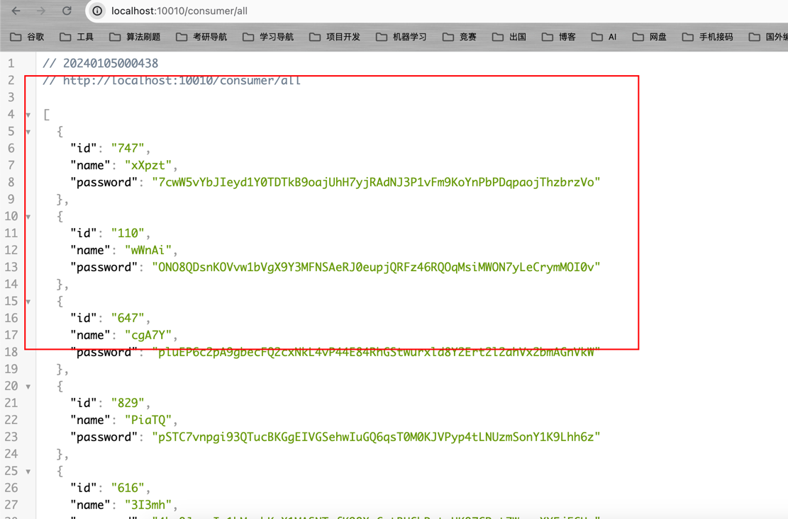

# 微服务网关-Gateway

&emsp;SpringCloud Gateway 是 Spring Cloud 的一个全新项目，它旨在为微服务架构提供一种简单有效的统一的 API 路由管理方式。

- 官方文档：[https://docs.spring.io/spring-cloud-gateway/docs/4.0.7/reference/html/](https://docs.spring.io/spring-cloud-gateway/docs/4.0.7/reference/html/)

## Netty介绍

&emsp;Spring Cloud Gateway 底层使用了高性能的通信框架Netty。Netty 是高性能中间件的通讯底座， rocketmq 、seata、nacos 、sentinel 、redission 、dubbo 等太多、太多的的大名鼎鼎的中间件，无一例外都是基于netty。

- netty官网:[https://netty.io/](https://netty.io/)
- GitHub地址:[https://github.com/netty/netty](https://github.com/netty/netty)

## 微服务网关搭建

&emsp;创建一个Maven子模块`cloud-gateway`,引入下述依赖：

```xml
<dependencies>
    <dependency>
        <groupId>org.springframework.cloud</groupId>
        <artifactId>spring-cloud-starter-gateway</artifactId>
    </dependency>
    <dependency>
        <groupId>org.springframework.cloud</groupId>
        <artifactId>spring-cloud-starter-netflix-eureka-client</artifactId>
    </dependency>
</dependencies>
```

> 网关本身也是微服务，因此需要引入eureka进行服务注册。

&emsp;创建`application.yml`配置文件，并配置下述信息:

```yaml
server:
  port: 10010

spring:
  application:
    name: CloudGateway
  cloud:
    gateway:
      routes:
        - id: user-provider # 路由ID， 必须唯一
          uri: lb://UserConsumer # 路由的目标地址，lb = Load Balance 负载均衡
          predicates:
            - Path=/consumer/** # 将/consumer/**请求转发到UserConsumer（/consumer/all）
  main:
    web-application-type: reactive # 因为Gateway是基于Netty实现的,所以需要设置Spring-Web为响应式类型。

# 向eureka进行服务注册
eureka:
  client:
    service-url:
      defaultZone: http://localhost:8761/eureka/
  instance:
    prefer-ip-address: true

```

&emsp;然后创建`CloudGatewayApplication`启动类。

```java
package org.ning;

import org.springframework.boot.SpringApplication;
import org.springframework.boot.autoconfigure.SpringBootApplication;

/**
 * @Project: org.ning
 * @Author: pgthinker
 * @Date: 2024/1/4 23:46
 * @Description:
 */
@SpringBootApplication
public class CloudGatewayApplication {
    public static void main(String[] args) {
        SpringApplication.run(CloudGatewayApplication.class, args);
    }
}
```

&emsp;启动`CloudGatewayApplication`，并访问`localhost:10010/consumer/all`。



&emsp;Mac M1下启动可能会报下述错误:

```text
Unable to load io.netty.resolver.dns.macos.MacOSDnsServerAddressStreamProvider, fallback to system defaults. This may result in incorrect DNS resolutions on MacOS. Check whether you have a dependency on 'io.netty:netty-resolver-dns-native-macos'. Use DEBUG level to see the full stack: java.lang.UnsatisfiedLinkError: failed to load the required native library
```

&emsp;解决方案就是引入下述依赖:

```xml
<dependency>
    <groupId>io.netty</groupId>
    <artifactId>netty-resolver-dns-native-macos</artifactId>
    <version>4.1.73.Final</version>
    <classifier>osx-aarch_64</classifier>
</dependency>
```

&emsp;请参考[issue](https://github.com/netty/netty/issues/11020).

## Gateway全局过滤器

&emsp;全局过滤器的作用就是处理一切进入网关的请求和微服务响应，除了全局过滤器外，还有[GatewayFilter](https://docs.spring.io/spring-cloud-gateway/docs/4.0.7/reference/html/#gatewayfilter-factories)。GatewayFilter相较于GlobalFilter来说，处理逻辑是固定的，可以直接通过配置文件进行配置，而GlobalFilter的逻辑则需要自己写代码进行实现。

&emsp;定义全局过滤器的方式就是实现`GlobalFilter`接口。

```java

package org.springframework.cloud.gateway.filter;

import reactor.core.publisher.Mono;

import org.springframework.web.server.ServerWebExchange;

public interface GlobalFilter {

	/**
     * 处理当前请求，
	 * @param exchange 请求的上下文，可以通过该对象获取request、response信息
	 * @param chain 用来将请求委托给下一个过滤器
	 * @return 标识当前过滤器业务结束 
	 */
	Mono<Void> filter(ServerWebExchange exchange, GatewayFilterChain chain);

}
```

&emsp;全局过滤器可搭配Spring Security使用。

## 网关跨域配置

&emsp;网关处理跨域采用的是CORS方案，只需在`application.yml`配置文件中进行如下配置即可。

```yaml
spring:
  application:
    name: CloudGateway
  cloud:
    gateway:
      routes:
        - id: user-provider # 路由ID， 必须唯一
          uri: lb://UserConsumer # 路由的目标地址，lb = Load Balance 负载均衡
          predicates:
            - Path=/consumer/** # 将/consumer/**请求转发到UserConsumer（/consumer/all）
      globalcors:
        add-to-simple-url-handler-mapping: true
        cors-configurations:
          '[/**]':
            allowedOrigins: # 允许哪些网站进行跨域
              - "http://localhost:5731"
            allowed-methods: # 允许跨域的Ajax请求方式
              - "GET"
              - "POST"
              - "DELETE"
              - "PUT"
              - "OPTIONS"
            allowedHeaders: "*" # 允许在请求中携带的头信息
            allowCredentials: true # 是否允许携带cookie
            maxAge: 360000 # 跨域检测有效期
```
