# 消息队列

## 概述

&emsp;消息队列是分布式系统中重要的组件，其通用的使用场景可以简单地描述为：

> 当不需要立即获得结果，但是并发量又需要进行控制的时候，就需要使用消息队列。

&emsp;消息队列主要解决了应用耦合、异步处理、流量削锋等问题。

- 应用耦合：多应用间通过消息队列对同一消息进行处理，避免调用接口失败导致整个过程失败；
- 异步处理：多应用对消息队列中同一消息进行处理，应用间并发处理消息，相比串行处理，减少处理时间；
- 限流削峰：广泛应用于秒杀或抢购活动中，避免流量过大导致应用系统挂掉的情况；
- 消息驱动的系统：系统分为消息队列、消息生产者、消息消费者，生产者负责产生消息，消费者(可能有多个)负责对消息进行处理；

## 同步通讯与异步通讯

### 同步通讯

&emsp;发送方发送数据后，必须等待接收方发回响应以后才发下一个数据包的通讯。

&emsp;例如：**你面对面跟我说要请我去看电影，我需要接受后，你才能和我一起去看电影**。

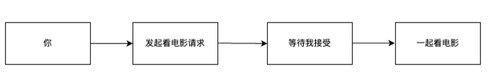

### 异步通信

&emsp;发送方发出数据后，不等待接收方发回响应，直接发送下一个数据包的通讯的方式。

&emsp;例如: **你通过微信给我发消息说请我看电影，然后你就可以去化妆了，而不需要等我微信回复你。**

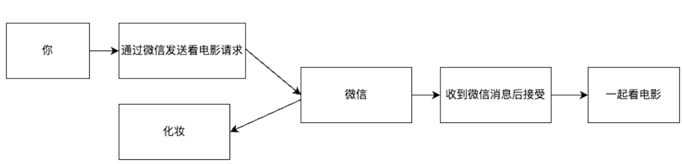

&emsp;消息队列就是异步通信的一个中间件，通过消息队列，就可以实现微服务之间的异步通信。

&emsp;当前使用较多的消息队列有RabbitMQ、RocketMQ、ActiveMQ、Kafka、ZeroMQ、MetaMq等，而部分数据库如Redis、Mysql以及phxsql也可实现消息队列的功能。

## RabbitMQ 介绍

&emsp;RabbitMQ是基于Erlang语言开发的开源消息通信中间件。

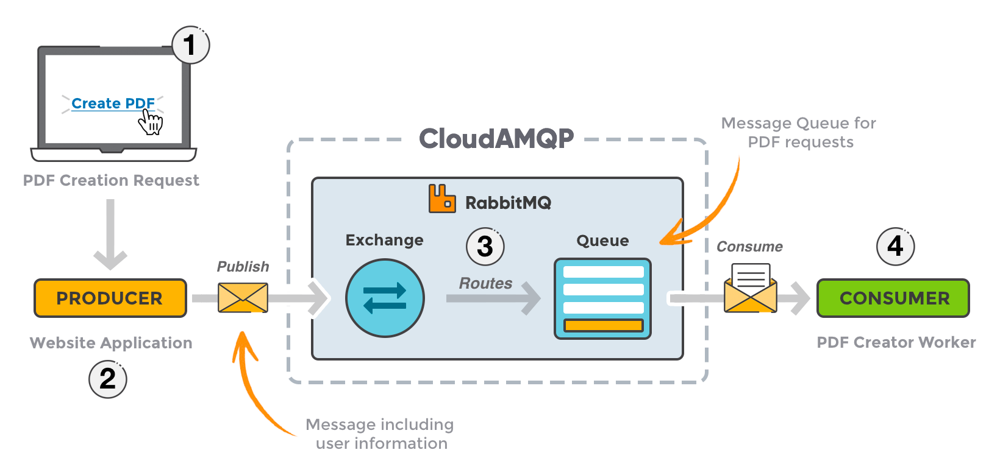

- 官网地址：[https://www.rabbitmq.com/](https://www.rabbitmq.com/)
- 官网教程：[https://www.rabbitmq.com/getstarted.html](https://www.rabbitmq.com/getstarted.html)

> Erlang语言是一种通用的并发函数式程序设计语言。

### 安装

&emsp;为简单起见，RabbitMQ使用Docker安装。

```shell
docker run -d --hostname my-rabbit \
  -p 15672:15672 \
  -p 5672:5672 \
  --name some-rabbit \
  -e RABBITMQ_DEFAULT_USER=username \
  -e RABBITMQ_DEFAULT_PASS=password \
  rabbitmq:3-management
```

&emsp;容器运行后，可以访问`IP:15672`进入RabbitMQ的管理页面。

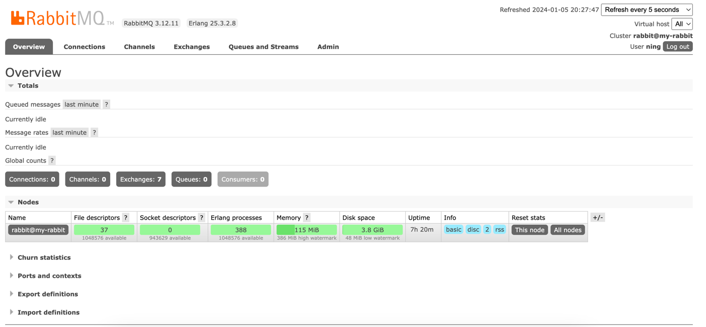

### RabbitMQ中的相关概念

- **channel**: 操作MQ的工具
- **exchange**：路由消息到队列中
- **queue**：缓存消息
- **virtual host**：虚拟主机，是对queue、exchange等资源的逻辑分组。

### RabbitMQ 中常见的消息模型

#### 基本消息队列

&emsp;基本消息队列：BasicQueue。

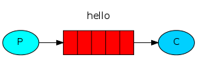

#### 工作消息队列

&emsp;工作消息队列：WorkQueue.

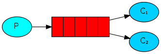

#### 发布订阅

&emsp;根据交换机类型可分为三种:`广播`、`路由`、`主题`。

##### Fanout Exchange

&emsp;广播消息队列。

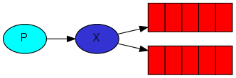

##### Direct Exchange

&emsp;路由消息队列。

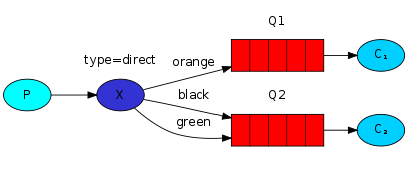

##### Topic Exchange

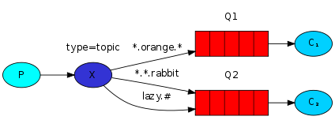

## Spring AMQP

&emsp;AMQP(Advanced Message Queuing Protocol)是用于在应用程序或之间传递业务消息的开放标准。该协议**与语言和平台无关**，更符合微服务中独立性的要求。

&emsp;Spring AMQP是基于AMQP协议定义的一套API规范，提供了模板来发送和接收消息。其中包含两部分，`Spring-amqp`是基础抽象，`Spring-rabbit`是底层的默认实现。我们可以使用RabbitTemplate来发送消息到RabbitMQ队列中。

> 可类比RedisTemplate来操作Redis。

## 使用

&emsp;引入下述依赖:

```xml
 <dependency>
    <groupId>org.springframework.boot</groupId>
    <artifactId>spring-boot-starter-amqp</artifactId>
</dependency>
```

&emsp;接下来将会创建两个模块来演示消息队列的发送与接收，其中，发送使用单元测试执行，接收使用Spring AMQP提供的监听容器。

&emsp;我们在父工程下引入上述提到的spring-amqp依赖，然后创建两个模块，一个`rabbit-privider`，它会使用单元测试向rabbitMQ发送消息；一个`rabbit-consumer`,它会监听来自rabbit的消息。

&emsp;Rabbit-Provider模块:

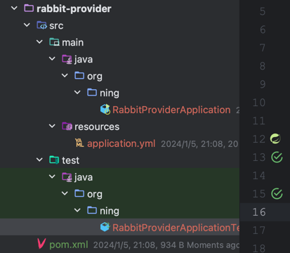

&emsp;配置文件如下:

```yaml
server:
  port: 8030

spring:
  rabbitmq:
    host: xx.xx.xx.xx # RabbitMQ的主机名
    port: 5672 # RabbitMQ的端口
    virtual-host: / # 虚拟主机路径
    username: username # RabbitMQ用户名
    password: password # RabbitMQ密码
```

&emsp;Rabbit-Consumer模块:

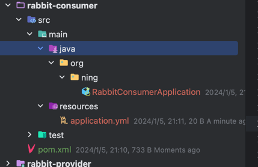

&emsp;consumer的rabbitmq配置文件和provider的一致:

```yaml
server:
  port: 8031

spring:
  rabbitmq:
    host: xx.xx.xx.xx # RabbitMQ的主机名
    port: 5672 # RabbitMQ的端口
    virtual-host: / # 虚拟主机路径
    username: username # RabbitMQ用户名
    password: password # RabbitMQ密码
```

### 1. 实现基本消息队列的发送与接收


#### Provider发送消息

&emsp;在rabbit-provider里编写一个单元测试用于发送消息。

```java
package org.ning;

import org.junit.jupiter.api.Test;
import org.springframework.amqp.core.Queue;
import org.springframework.amqp.rabbit.core.RabbitAdmin;
import org.springframework.amqp.rabbit.core.RabbitTemplate;
import org.springframework.beans.factory.annotation.Autowired;
import org.springframework.boot.test.context.SpringBootTest;

/**
 * @Project: org.ning
 * @Author: pgthinker
 * @Date: 2024/1/5 21:08
 * @Description:
 */
@SpringBootTest
public class RabbitProviderApplicationTests {

    @Autowired
    private RabbitTemplate rabbitTemplate;
    @Test
    public void testSendBasicMessage2Queue(){
        String queueName = "basic.queue"; // 消息队列名称
        String message = "Hello RabbitMQ"; // 消息内容
        RabbitAdmin admin = new RabbitAdmin(rabbitTemplate); // 创建RabbitAdmin对象
        Queue queue = new Queue(queueName); // 创建消息队列对象
        admin.declareQueue(queue); // 该方法会在RabbitMQ里创建一个消息队列
        rabbitTemplate.convertAndSend(queueName,message); // 发送消息
    }
}
```

&emsp;执行完成后，我们可以前往RabbitMQ后台管理页面查看相关内容。

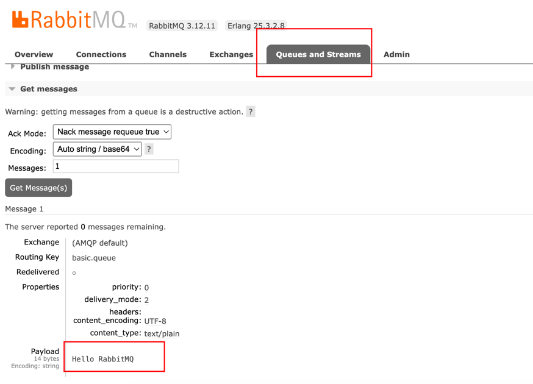

#### Consumer接收消息

&emsp;Spring AMQP为我们提供了消息监听容器，我们只需要创建对应的消息队列监听容器即可接收对应的消息队列发过来的消息内容。

```java
package org.ning.listener;

import lombok.extern.slf4j.Slf4j;
import org.springframework.amqp.rabbit.annotation.RabbitListener;
import org.springframework.stereotype.Component;

/**
 * @Project: org.ning.listener
 * @Author: pgthinker
 * @Date: 2024/1/5 21:39
 * @Description:
 */
@Component
@Slf4j
public class BaseQueueListener {
    @RabbitListener(queues = "basic.queue")
    public void listenBasicQueueMessage(String message) {
        log.info("=====>接收到消息:{}",message);
    }
}
```

&emsp;使用`@RabbitListener(queues = "消息队列名称")`来监听某个消息队列的消息。

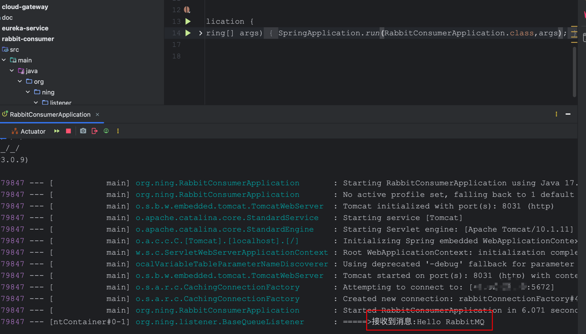

&emsp;**消息一旦消费，就会从队列中删除，RabbitMQ没有消息回溯功能**。

### 2. 实现工作消息队列的发送与接收


&emsp;工作消息队列其实与基本消息队列并无区别，只是在工作消息队列中，处理消息的消费者会更多，用于提高消息处理的速度，避免消息队列里的消息堆积。

#### Provider发送消息

&emsp;在Provider里编写一个测试类，生成多条消息。

```java
package org.ning;

import org.junit.jupiter.api.Test;
import org.springframework.amqp.core.Queue;
import org.springframework.amqp.rabbit.core.RabbitAdmin;
import org.springframework.amqp.rabbit.core.RabbitTemplate;
import org.springframework.beans.factory.annotation.Autowired;
import org.springframework.boot.test.context.SpringBootTest;

/**
 * @Project: org.ning
 * @Author: pgthinker
 * @Date: 2024/1/5 21:08
 * @Description:
 */
@SpringBootTest
public class RabbitProviderApplicationTests {
    @Autowired
    private RabbitTemplate rabbitTemplate;
    
    @Test
    public void testSendWorkMessage2Queue() throws InterruptedException {
        String queueName = "work.queue";
        String message = "Hello RabbitMQ ";
        RabbitAdmin admin = new RabbitAdmin(rabbitTemplate);
        Queue queue = new Queue(queueName);
        admin.declareQueue(queue);
        for (int i = 0; i < 100; i++) {
            rabbitTemplate.convertAndSend(queueName, message + i);
            Thread.sleep(20); // 睡眠几毫秒
        }
    }
}

```

#### Consumer接受消息

&emsp;创建多个消费者，即监听同一个消息队列。

```java
package org.ning.listener;

import lombok.extern.slf4j.Slf4j;
import org.springframework.amqp.rabbit.annotation.RabbitListener;
import org.springframework.stereotype.Component;

/**
 * @Project: org.ning.listener
 * @Author: pgthinker
 * @Date: 2024/1/5 21:55
 * @Description:
 */
@Component
@Slf4j
public class WorkQueueListener {
    @RabbitListener(queues = "work.queue")
    public void consumer1(String message) throws InterruptedException {
        log.info("consumer-1:{}",message);
        Thread.sleep(20); // 设置不同的消费者消费能力
    }
    @RabbitListener(queues = "work.queue")
    public void consumer2(String message) throws InterruptedException {
        log.info("consumer-2:{}",message);
        Thread.sleep(200);
    }
}

```

&emsp;通过日志可以发现，就算每个消费者的消费能力不同，处理的消息数量仍然是一样的。这意味者，RabbitMQ不会根据你消费能力强而分配给你更多的消息处理。

&emsp;这种情况是因为RabbitMQ内部有一个`消息预取机制`，消息预取机制会使得每个监听者提前获取消息,这就会造成即使你的消费能力不行，也可以拿到其它消费者一样的消息数量。解决方案就是在消息消费者里的配置文件配置`preFetch`的值。

```yaml
server:
  port: 8031

spring:
  rabbitmq:
    host: xx.xx.xx.xx
    port: 5672
    virtual-host: /
    username: username
    password: password
    listener:
      simple:
        prefetch: 1 # 只有消费完消息后才会继续处理下一个
```

### 3. 发布与订阅模式

&emsp;发布与订阅模式与上面的两个案例的区别在于：`允许同一消息发送给多个消费者`。实现方式就是加入exchange(交换机)。

> 我们无需改动消息消费者的代码，只需要改动消息发布者的代码即可。

#### 3.1 Fanout Exchange


&emsp;Fanout Exchange会将接收到的消息路由到每一个跟其绑定的queue。

##### Provider 发送消息

```java
package org.ning;

import org.junit.jupiter.api.Test;
import org.springframework.amqp.core.*;
import org.springframework.amqp.rabbit.core.RabbitAdmin;
import org.springframework.amqp.rabbit.core.RabbitTemplate;
import org.springframework.beans.factory.annotation.Autowired;
import org.springframework.boot.test.context.SpringBootTest;

/**
 * @Project: org.ning
 * @Author: pgthinker
 * @Date: 2024/1/5 21:08
 * @Description:
 */
@SpringBootTest
public class RabbitProviderApplicationTests {

    @Autowired
    private RabbitTemplate rabbitTemplate;

    @Test
    public void testSendFanoutExchangeMessage2Queue() throws InterruptedException {
        String queueName1 = "fanout.queue1";
        String queueName2 = "fanout.queue2";
        String fanoutExchangeName = "fanout.exchange";

        String message = "Hello RabbitMQ ";
        // 创建RabbitAdmin对象
        RabbitAdmin admin = new RabbitAdmin(rabbitTemplate);

        // 创建一个交换机
        FanoutExchange fanoutExchange = new FanoutExchange(fanoutExchangeName);
        admin.declareExchange(fanoutExchange);
        // 创建队列
        Queue queue1 = new Queue(queueName1);
        Queue queue2 = new Queue(queueName2);
        admin.declareQueue(queue1);
        admin.declareQueue(queue2);
        // 创建绑定关系
        admin.declareBinding(BindingBuilder.bind(queue1).to(fanoutExchange));
        admin.declareBinding(BindingBuilder.bind(queue2).to(fanoutExchange));
        // 向交换机里发送50条消息
        for (int i = 0; i < 50; i++) {
            rabbitTemplate.convertAndSend(fanoutExchangeName,"",message + i);
            Thread.sleep(20);
        }
    }
}
```

##### Consumer 消费消息

```java
package org.ning.listener;

import lombok.extern.slf4j.Slf4j;
import org.springframework.amqp.rabbit.annotation.RabbitListener;
import org.springframework.stereotype.Component;

/**
 * @Project: org.ning.listener
 * @Author: pgthinker
 * @Date: 2024/1/5 22:32
 * @Description:
 */
@Component
@Slf4j
public class FanoutExchangeListener {
    @RabbitListener(queues = "fanout.queue1")
    public void listenExchangeQueue1(String message){
        log.info("queue1的消息==>{}",message);
    }
    
    @RabbitListener(queues = "fanout.queue2")
    public void listenExchangeQueue2(String message){
        log.info("queue2的消息==>{}",message);
    }
}
```

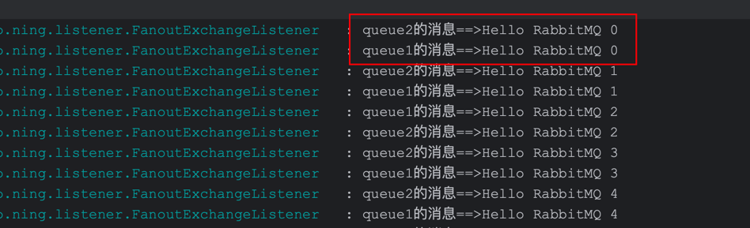

&emsp;可以看到，多个消息消费者都会接收到消息。

#### 3.2 Direct Exchange

&emsp;Direct Exchange会将接收到的消息根据规则路由到指定的Queue，因此称为路由模式(Routes)。

> - 每一个Queue在与Direct Exchange进行绑定时，都会设置一个唯一的Binding Key;
> - 发送消息时，可以设置Binding Key将消息发送到指定Queue.


##### Provider 发送消息

```java
package org.ning;

import org.junit.jupiter.api.Test;
import org.springframework.amqp.core.*;
import org.springframework.amqp.rabbit.core.RabbitAdmin;
import org.springframework.amqp.rabbit.core.RabbitTemplate;
import org.springframework.beans.factory.annotation.Autowired;
import org.springframework.boot.test.context.SpringBootTest;

/**
 * @Project: org.ning
 * @Author: pgthinker
 * @Date: 2024/1/5 21:08
 * @Description:
 */
@SpringBootTest
public class RabbitProviderApplicationTests {

    @Autowired
    private RabbitTemplate rabbitTemplate;
    
    @Test
    public void testSendDirectExchangeMessage2Queue() throws InterruptedException {
        String queueName1 = "direct.queue1";
        String queueName2 = "direct.queue2";
        String directExchangeName = "direct.exchange";
        String message = "Hello RabbitMQ ";
        Queue queue1 = new Queue(queueName1);
        Queue queue2 = new Queue(queueName2);
        DirectExchange directExchange = new DirectExchange(directExchangeName);
        RabbitAdmin admin = new RabbitAdmin(rabbitTemplate);
        // 创建消息队列
        admin.declareQueue(queue1);
        admin.declareQueue(queue2);
        // 创建Direct交换机
        admin.declareExchange(directExchange);
        // 绑定消息队列与交换机
        admin.declareBinding(
                BindingBuilder.bind(queue1)
                        .to(directExchange)
                        .with("queue" + 1)
        );
        admin.declareBinding(
                BindingBuilder.bind(queue2)
                        .to(directExchange)
                        .with("queue" + 2)
        );
        // 发送消息
        for (int i = 0; i < 100; i++) {
            int routingKey = i % 2 == 0 ? 1 : 2; // 如果i为偶数，则routingKey = queue1
            rabbitTemplate.convertAndSend(directExchangeName,"queue" + routingKey, message + i);
            Thread.sleep(20);
        }
    }
}
```

##### Consumer 发送消息

```java
package org.ning.listener;

import lombok.extern.slf4j.Slf4j;
import org.springframework.amqp.core.ExchangeTypes;
import org.springframework.amqp.rabbit.annotation.Exchange;
import org.springframework.amqp.rabbit.annotation.Queue;
import org.springframework.amqp.rabbit.annotation.QueueBinding;
import org.springframework.amqp.rabbit.annotation.RabbitListener;
import org.springframework.stereotype.Component;

/**
 * @Project: org.ning.listener
 * @Author: pgthinker
 * @Date: 2024/1/5 23:07
 * @Description:
 */
@Component
@Slf4j
public class DirectExchangeListener {
    @RabbitListener(bindings = @QueueBinding(
            value = @Queue(name = "direct.queue1"), // 绑定队列
            exchange = @Exchange(name = "direct.exchange", type = ExchangeTypes.DIRECT), // 绑定交换机
            key = {"queue1","queue2"} // 绑定RoutingKey值
    ))// 当RoutingKey 为queue1和queue2时，会接收来自direct.exchange的交换机的direct.queue1队列的消息
    public void listenDirectQueue12(String message){
        log.info("direct.queue1接收到消息===>{}",message);
    }

    @RabbitListener(bindings = @QueueBinding(
            value = @Queue(name = "direct.queue2"),
            exchange = @Exchange(name = "direct.exchange", type = ExchangeTypes.DIRECT),
            key = {"queue2"}
    ))
    public void listenDirectQueue1(String message){
        log.info("direct.queue2接收到消息===>{}",message);
    }
}
```

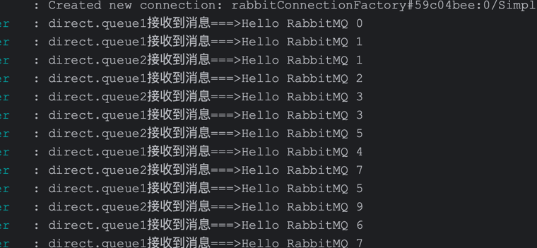

#### 3.3 Topic Exchange

&emsp;Topic Exchange与Direct Exchange类似，区别在于Routing Key必须是多个单词的列表，并且以`.`分割。


&emsp;Queue与Exchange指定Binding Key时可以使用通配符:

- `#`: 代指0个或多个单词
- `*`：代指一个单词

##### Provider 消息生产

```java
package org.ning;

import org.junit.jupiter.api.Test;
import org.springframework.amqp.core.*;
import org.springframework.amqp.rabbit.core.RabbitAdmin;
import org.springframework.amqp.rabbit.core.RabbitTemplate;
import org.springframework.beans.factory.annotation.Autowired;
import org.springframework.boot.test.context.SpringBootTest;

/**
 * @Project: org.ning
 * @Author: pgthinker
 * @Date: 2024/1/5 21:08
 * @Description:
 */
@SpringBootTest
public class RabbitProviderApplicationTests {
    
    @Autowired
    private RabbitTemplate rabbitTemplate;

     @Test
    public void testSendTopicExchangeMessage2Queue() {

        RabbitAdmin admin = new RabbitAdmin(rabbitTemplate);

        // 创建队列
        String queueName1 = "topic.queue1";
        String queueName2 = "topic.queue2";
        Queue queue1 = new Queue(queueName1);
        Queue queue2 = new Queue(queueName2);
        admin.declareQueue(queue1);
        admin.declareQueue(queue2);
        // 创建TopicExchange
        String topicExchangeName = "topic.exchange";
        TopicExchange topicExchange = new TopicExchange(topicExchangeName);
        admin.declareExchange(topicExchange);
        // 创建绑定关系
        admin.declareBinding(
                BindingBuilder.bind(queue1)
                        .to(topicExchange)
                        .with("rabbit.news")
        );
        admin.declareBinding(
                BindingBuilder.bind(queue2)
                        .to(topicExchange)
                        .with("rabbit.facebook")
        );
        // 生产一些消息
        rabbitTemplate.convertAndSend(topicExchangeName,"rabbit.news","这是news的消息");
        rabbitTemplate.convertAndSend(topicExchangeName,"rabbit.facebook","这是facebook的消息");
    }
}

```

##### Consumer 消息消费


```java
package org.ning.listener;

import lombok.extern.slf4j.Slf4j;
import org.springframework.amqp.core.ExchangeTypes;
import org.springframework.amqp.rabbit.annotation.Exchange;
import org.springframework.amqp.rabbit.annotation.Queue;
import org.springframework.amqp.rabbit.annotation.QueueBinding;
import org.springframework.amqp.rabbit.annotation.RabbitListener;
import org.springframework.stereotype.Component;

/**
 * @Project: org.ning.listener
 * @Author: pgthinker
 * @Date: 2024/1/5 23:41
 * @Description:
 */
@Component
@Slf4j
public class TopicExchangeListener {
    @RabbitListener(bindings = @QueueBinding(
            value = @Queue(name = "topic.queue1"),
            exchange = @Exchange(name = "topic.exchange", type = ExchangeTypes.TOPIC),
            key = {"topic.#"} // 发送到facebook的消息也会接收
    ))
    public void listenTopicAllMessage(String message){
        log.info("所有来自topic.#的消息===>{}",message);
    }

    @RabbitListener(bindings = @QueueBinding(
            value = @Queue(name = "topic.queue2"),
            exchange = @Exchange(name = "topic.exchange", type = ExchangeTypes.TOPIC),
            key = {"topic.facebook"}
    ))
    public void listenTopicFacebookMessage(String message){
        log.info("所有来自topic.facebook的消息===>{}",message);
    }
}
```

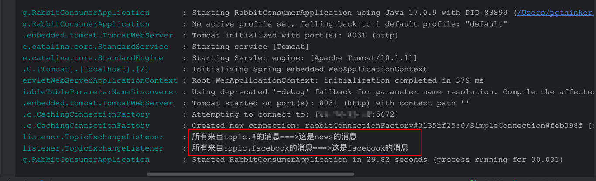

## 其它

&emsp;Spring AMQP在发送对象消息时，默认是用`SimpleMessageConverter`,这是基于JDK的`ObjectOutputStream`完成的序列化。

&emsp;如果需要修改，只需要定义一个MessageConverter类型的Bean即可。推荐使用JSON方式的序列化，操作如下：

- 在父级模块中引入依赖

```xml
<dependency>
    <groupId>com.fasterxml.jackson.dataformat</groupId>
    <artifactId>jackson-dataformat-xml</artifactId>
    <version>2.9.10</version>
</dependency>
```

- 在消息生产者和消费者里声明`MessageConverter`

```java
@Bean
public MessageConverter jsonMessageConverter(){
    return new Jackson2JsonMessageConverter();
}
```

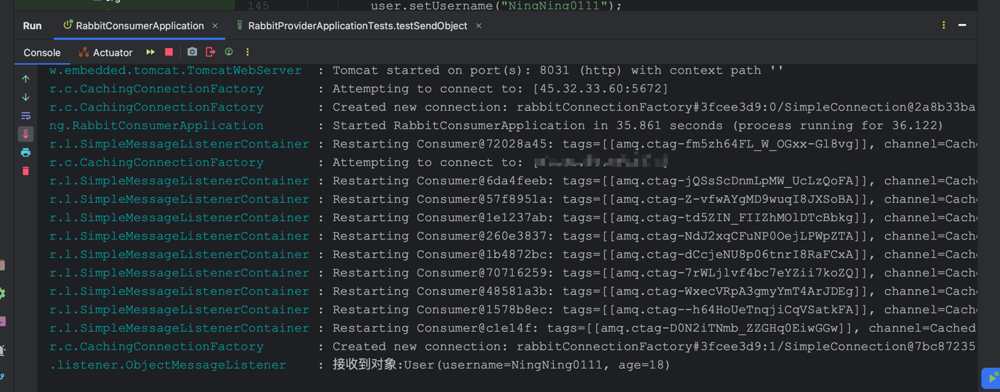


