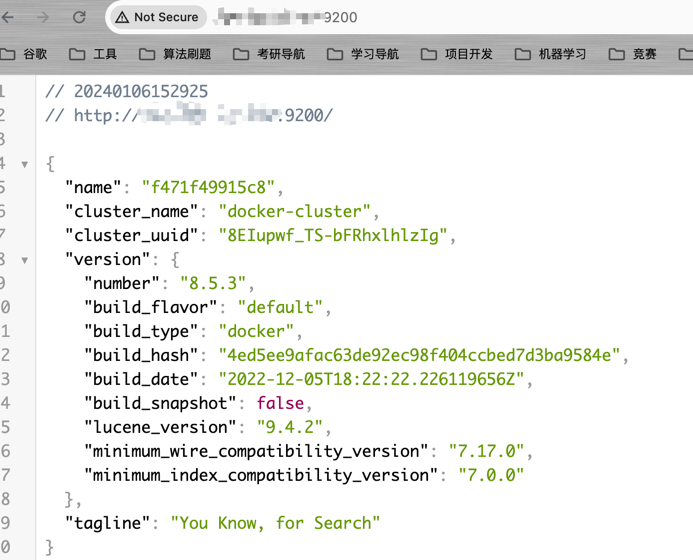

## 安装ElasticSearch

```shell
# 创建一个网络
docker network create es-net
# 拉取镜像
docker pull elasticsearch:8.11.3
# 部署单节点es
docker run -d \
  --name es \
  -e "ES_JAVA_OPTS=-Xms512m -Xmx512m" \
  -e "discovery.type=single-node" \
  -v es-data:/usr/share/elasticsearch/data \
  -v es-plugins:/usr/share/elasticsearch/plugins \
  --privileged \
  --network es-net \
  -p 9200:9200 \
  -p 9300:9300 elasticsearch:8.11.3
# 添加一个超级管理员用户
## 进入容器
docker exec -it es /bin/bash
## 执行命令
./bin/elasticsearch-users useradd 用户名 -p 密码 -r superuser
```

&emsp;访问`IP:9200`,出现503错误时，请确保服务器9200端口正常放开。



## 安装Kibana

```shell
# 拉取镜像
docker pull kibana:8.11.3
# 部署
docker run -d \
  --name kibana \
  -e ELASTICSEARCH_HOSTS=http://es:9200 \
  --network=es-net \
  -p 5601:5601 kibana:8.11.3
# 进入elasticsearch容器里为kibana创建一个token
docker exec -it es /bin/bash
./bin/elasticsearch-reset-password -u kibana_system --auto
```


&emsp;拿到token后，修改kibana容器里config/kibana.yml配置文件，加入下述内容:

```shell
docker cp kibana:/usr/share/kibana/config/kibana.yml kibana.yml
```

```yaml
#
# ** THIS IS AN AUTO-GENERATED FILE **
#

# Default Kibana configuration for docker target
server.host: "0.0.0.0"
server.shutdownTimeout: "5s"
elasticsearch.hosts: [ "http://elasticsearch:9200" ]
monitoring.ui.container.elasticsearch.enabled: true

elasticsearch.username: "kibana_system"
elasticsearch.password: "你的token值"
```

```shell
docker cp kibana.yml kibana:/usr/share/kibana/config/
```

> 容器内无法编辑时，可以通过`docker cp`命令将文件从容器内部拷贝出来，修改后再拷贝回去。


&emsp;完成后重启kibana容器，重启完成后，登录`IP:5601`页面，输入创建的超级管理员账号即可进入Kibana页面。

## 安装IK分词器

```shell
# 进入elasticsearch容器 运行下述命令
docker exec -it es /bin/bash
./bin/elasticsearch-plugin install https://github.com/medcl/elasticsearch-analysis-ik/releases/download/v8.11.3/elasticsearch-analysis-ik-8.11.3.zip
```


