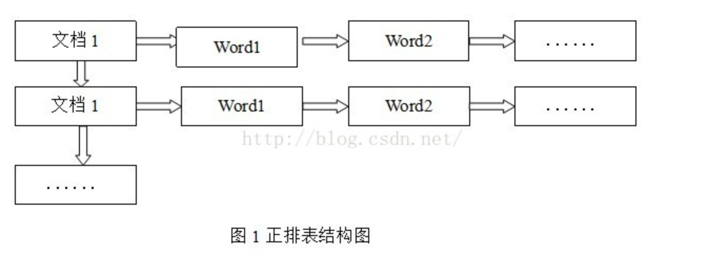
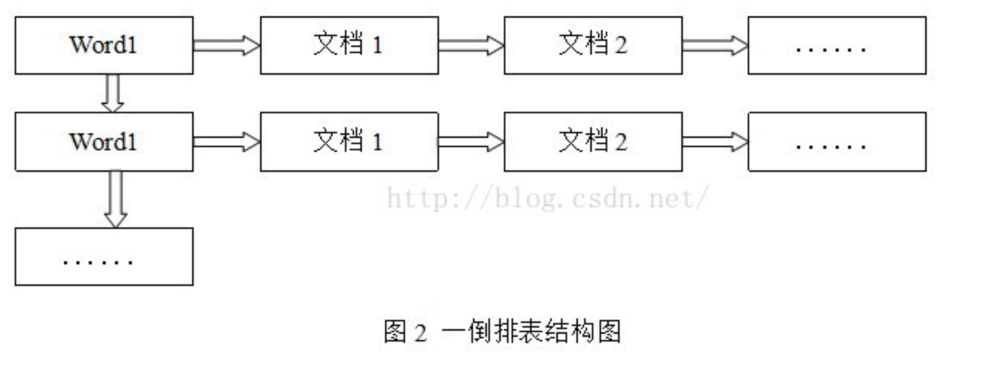
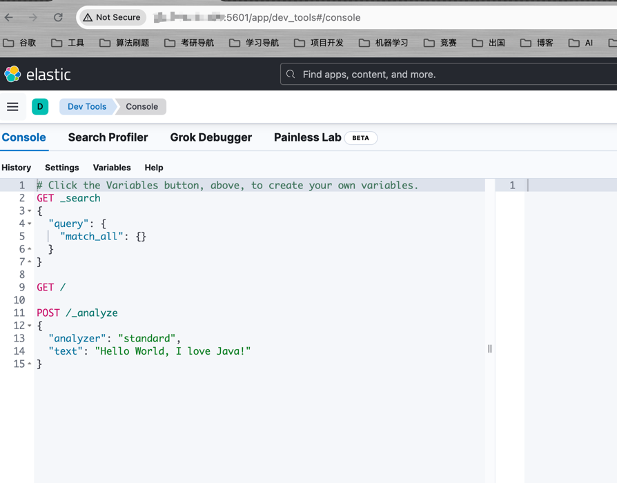

# ElasticSearch 

&emsp;ElasticSearch简称`ES`，是一款非常强大的开源搜索引擎，可以帮助我们从海量数据中快速找到需要的内容。

&emsp;ElasticSearch结合Kibana、Logstash、Beats，也就是Elastic Stack (ELK)，被广泛应用在日志数据分析、实时监控等领域。ElasticSearch是ELK的核心，负责存储、搜索、分析数据。

- 官方地址：[https://www.elastic.co/cn/](https://www.elastic.co/cn/)
- 开源地址：[https://github.com/elastic/elasticsearch](https://github.com/elastic/elasticsearch)

&emsp;ES的底层是基于`Lucene`开发的，`Lucene`是Java语言的搜索引擎类库，是Apache公司的顶级项目。

- 官方地址：[https://lucene.apache.org/](https://lucene.apache.org/)
- 开源地址：[https://github.com/apache/lucene](https://github.com/apache/lucene)

## 正向索引与倒排索引

&emsp;ES是基于Lucene实现的，而Lucene的核心技术是基于`倒排索引`实现的。

### 正向索引

&emsp;正向索引是根据正排表进行检索的。正排表是以文档的ID为关键字，表中记录文档中每个字的位置信息，查找时扫描表中每个文档中字的信息直到找出所有包含查询关键字的文档。



&emsp;正向索引的检索效率很低，除非在一些特定情况下，否则实用性价值很低。

### 倒排索引

&emsp;倒排索引是根据倒排表进行检索的。倒排表以字或词为关键字进行索引，表中关键字所对应的记录表项记录了出现这个字或词的所有文档，一个表项就是一个字表段，它记录该文档的ID和字符在该文档中出现的位置情况。

&emsp;由于每个字或词对应的文档数量在动态变化，所以倒排表的建立和维护都较为复杂，但是在查询的时候由于可以一次得到查询关键字所对应的所有文档，所以效率高于正排表。在全文检索中，检索的快速响应是一个最为关键的性能，而索引建立由于在后台进行，尽管效率相对低一些，但不会影响整个搜索引擎的效率。



## ES操作

&emsp;ES中是通过Restful请求，操作索引库、文档。请求内容用DSL语句来表示。

- 对索引库的增删查；
- 对文档的增删改查；

&emsp;我们可以在Kibana页面里的DevTool进行相关的操作。



### 索引库操作

#### 创建索引库

&emsp;语法：

```text
PUT /索引库名称
{
  "mappings": {
    "properties": {
      "字段名1": {
        "type": "text", # 字段的数据类型
        "analyzer": "ik_smart" # 分词器
      },
      "字段名2": {
        "type": "keyword", # 字段的类型
        "index": "false" # 指定该字段不需要被索引
      },
      "字段名3": {
        "properties": {
          "子字段": {
            "type": "keyword"
          }
        }
      }
    }
  }
}
```

&emsp;ES支持多种字段类型，常见的字段类型包括：

- Text（文本类型）：用于存储长文本数据，支持全文搜索和分词等操作。

- Keyword（关键字类型）：用于存储短文本数据，通常用于精确匹配和聚合操作。

- Numeric（数值类型）：包括整数和浮点数类型，用于存储数值数据，支持范围查询和聚合操作。

- Date（日期类型）：用于存储日期和时间数据，支持日期范围查询和日期计算等操作。

- Boolean（布尔类型）：用于存储布尔值（true或false）。

- Object（对象类型）：用于存储复杂结构的数据，可以嵌套其他字段。

- Array（数组类型）：用于存储多个相同类型的值。

&emsp;此外，ES还支持更高级的字段类型，如Geo（地理位置类型）、IP（IP地址类型）、Binary（二进制类型）等。

##### 案例

&emsp;创建一个`文章`(articles)索引库。包含：`title`，`content`,`author`,`publish_date`,`tags`

```text
PUT articles
{
  "mappings": {
    "properties": {
      "title": {
        "type": "text"
      },
      "content": {
        "type": "text"
      },
      "author": {
        "type": "keyword"
      },
      "publish_date": {
        "type": "date"
      },
      "tags": {
        "type": "keyword"
      }
    }
  }
}
```

#### 查询索引库

```text
GET /索引库名称
```

#### 删除索引库

```text
DELETE /索引库名称
```

#### 修改索引库 ？

&emsp;原则上不允许对创建好的索引库进行任何修改，这里不做介绍。

### 文档操作

#### 添加文档

```text
POST /索引库名称/_doc/文档ID
{
  "字段1": "值1",
  "字段2": "值2",
  "字段3": {
    "子属性1": "子属性值1",
    "子属性2": "子属性值2"
  }
}
```

#### 案例

&emsp;往articles里添加一个数据。

```text
POST /articles/_doc/1
{
  "author": "NingNing0111",
  "content": "关于Spring Cloud的学习笔记",
  "publish_date": "2024-01-06",
  "tags": "Spring",
  "title": "ES操作"
}
```

#### 查询文档

```text
GET /索引库名称/_doc/文档ID
```

#### 删除文档

```text
DELETE /索引库名称/_doc/文档ID
```

> 在ES中，文档的删除操作实际上是标记为已删除，而不是真正地从磁盘中删除。这是因为ES使用了倒排索引的数据结构，它需要保持索引的完整性和一致性。

#### 修改文档

##### 1. 全量修改

```text
PUT /索引库名称/_doc/文档id
{
    "字段1": "值1",
    "字段2": "值2",
    "字段3": "值3",
    ...
}
```

&emsp;全量修改会**删除旧文档，添加新文档**。

> 即使之前没有旧文档可删，添加文档的操作仍然会继续执行。

##### 2. 增量修改

&emsp;增量修改可以修改指定的字段值。

```text
POST /索引库名称/_update/文档id
{
    "doc": {
        "字段名": "修改值"。
    }
}
```

